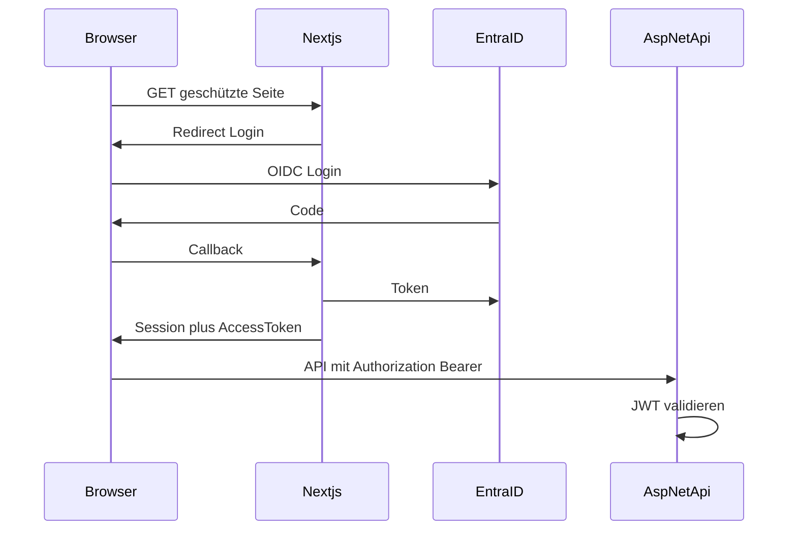

# Plan: Login mit Microsoft Entra ID und Azure-Betrieb

> Gespeichert für die nächste Umsetzung. Nicht als „fertig implementiert“ zu werten.

## Zielbild

- **Web** (`apps/web`): Nur eingeloggte Nutzer sehen die App; Login über Microsoft (Entra ID).
- **API** (`apps/api`): Geschützte Aufrufe mit **Bearer-JWT** von Entra; API validiert Signatur, Aussteller und Audience.
- **2 User**: **in Entra** steuern (Enterprise App / App-Registrierung nur jenen **2 Benutzern** oder einer **Gruppe** zuweisen). Die App vertraut dem Login; keine E-Mail-Allowlist in der Web-App.

## Ablauf (Überblick)

## 1. Microsoft Entra (Azure Portal)

- **Tenant** (bestehend oder neu).
- **App-Registrierung (API)** für das Backend:
  - Anwendungs-ID-URI z. B. `api://valentinrsm-api`.
  - **Expose an API**: Scope z. B. `access_as_user`.
  - Unter **Eigentümer** / **Unternehmensanwendung**: **Benutzerzuweisung erforderlich**; nur **2 Konten** (oder 1 Gruppe mit 2 Mitgliedern) zuweisen.
- **App-Registrierung (SPA/Client)** für Next.js:
  - Redirect URIs: `https://<prod-web>/.../callback`, `http://localhost:3000/.../callback`.
  - **API-Berechtigungen**: Delegierte Berechtigung auf die API-App (Scope von oben).
- **Geheimnisse**: Client Secret nur falls nötig; sonst PKCE ohne Secret für SPA.

Dokumentation der Werte (Tenant-ID, Client-ID, API-URI, Scope) in `docs/INSTALLATION.md` ergänzen (ohne Secrets).

## 2. Next.js – Auth und Routenschutz

- **Bibliothek**: **Auth.js (next-auth v5)** mit Provider **Microsoft Entra ID**.
- Typische neue Dateien:
  - `apps/web/auth.ts` – Provider; `callbacks.signIn` vertraut Entra (keine App-seitige E-Mail-Allowlist).
  - `apps/web/app/api/auth/[...nextauth]/route.ts`.
  - `apps/web/middleware.ts` – Pfade unter `app/(app)/` schützen.
- Login-Seite z. B. `app/(auth)/login/page.tsx`.
- **SessionProvider** im Root-Layout.

**API-Aufrufe**: `apps/web/lib/api.ts` erweitern um `fetchWithAuth` / Bearer-Token aus Session für alle API-Calls.

## 3. ASP.NET Core – JWT-Bearer

- NuGet: **Microsoft.Identity.Web** (oder JWT Bearer mit Authority `https://login.microsoftonline.com/{tenantId}/v2.0`).
- `Program.cs`: `AddAuthentication().AddJwtBearer(...)`; `[Authorize]` auf Controllern oder global.
- **CORS**: `AllowedOrigins` um produktive Web-URL erweitern.
- Konfiguration: `AzureAd:TenantId`, `AzureAd:ClientId`, `AzureAd:Audience`.

## 4. Wer darf sich anmelden?

| Variante | Hinweis |
|----------|---------|
| **Entra (Unternehmens-App, Zuweisungen, Gruppen)** | **Genutzt:** Zugang nur hier steuern; die App führt keine zweite Allowlist. |
| **Conditional Access** | Zusätzliche Regeln (Standort, Gerät, …) in Entra. |

## 5. Azure-Hosting (Überblick)

- **Azure SQL**: Connection String in Key Vault; Referenz in Container Apps.
- **Azure Container Apps**: Container für **web**, **api**; Env für Entra, DB, `NEXT_PUBLIC_API_URL`.
- **n8n**: eigener Container; API-Zugriff später mit eigenem Client/API-Key (Bot-Phase).
- **Netzwerk**: Browser ruft API mit Bearer auf (öffentliche API + JWT); Alternative wäre Next-BFF (größerer Umbau).

## 6. Docker / lokal

- `docker-compose.yml`: Entra-Variablen per `.env` (nicht committen): Tenant, Client IDs, `NEXTAUTH_URL`, `NEXTAUTH_SECRET`, `AUTH_URL`.

## 7. Dokumentation

- `docs/PROJECT_CONTEXT.md`: MVP um **Anmeldung (Entra ID, 2 Nutzer)** ergänzen.
- Keine Secrets in Git.

## Umsetzungsreihenfolge (empfohlen)

1. Entra: API- + Client-App, Scope, Redirects, 2 User zuweisen.
2. API: JWT-Bearer + `[Authorize]`; Postman-Test mit Token.
3. Next: Auth.js + Middleware + Login; `fetchJson` mit Token.
4. Azure: Container Apps + SQL + Secrets; Prod-URLs in Entra + CORS.

## Checkliste (Todos)

- [ ] Entra: API- und Client-App-Registrierung, Scope, Redirects, 2 User zuweisen
- [ ] ASP.NET: Microsoft.Identity.Web / JWT Bearer, `[Authorize]`, Konfiguration
- [ ] Next.js: Auth.js Entra-Provider, middleware, Login-UI, SessionProvider
- [ ] `lib/api.ts`: API-Aufrufe mit Bearer-Token aus Session
- [ ] Azure: Container Apps, SQL, Key Vault/Env, CORS/URLs
- [ ] `INSTALLATION.md` + `PROJECT_CONTEXT.md` aktualisieren
